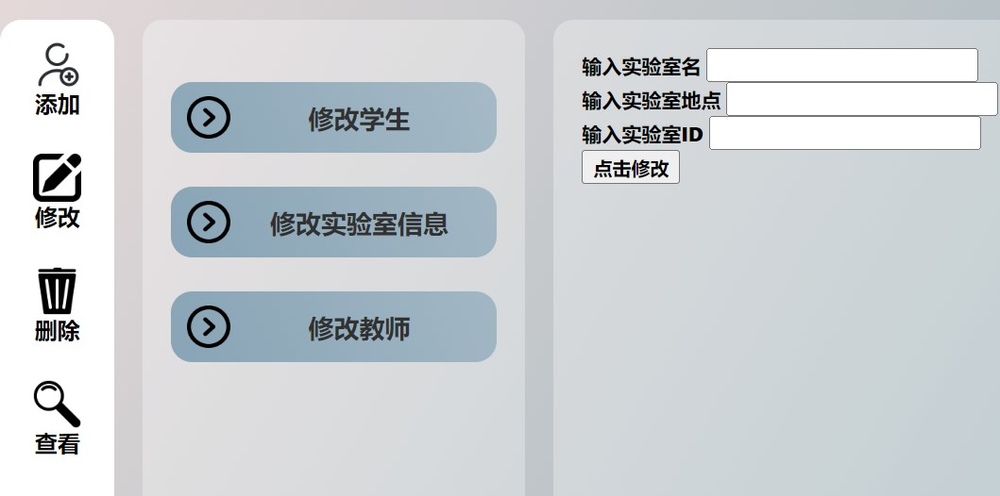

# JSP课程设计

## 实验室管理系统

#### 功能介绍

1.  用户验证登录
2.  实验室相关信息添加
    1.  添加学生
    2.  添加实验室
    3.  添加老师
3.  实验室相关信息修改
    1.  修改学生信息
    2.  修改实验室信息
    3.  修改老师信息
4.  实验室相关信息删除
    1.  删除学生
    2.  删除实验室
    3.  删除老师
    4.  删除管理员
5.  实验室相关信息查看
    1.  查看上课日志
        1.  指定实验室
        2.  指定班级
        3.  指定教师
    2.  学生信息查看
        1.  指定班级
    3.  老师查看
        1.  指定职称
    4.  实验室查看
        1.  指定实验室位置

<!---->

1.  登录界面

    
2.  主界面

    
    1.  添加

        

        

        
    2.  修改

        

        

        
    3.  删除

        

        

        
    4.  查看

        
# Laboratory_management
